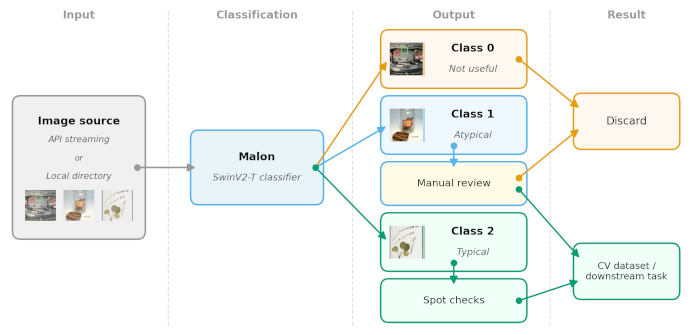
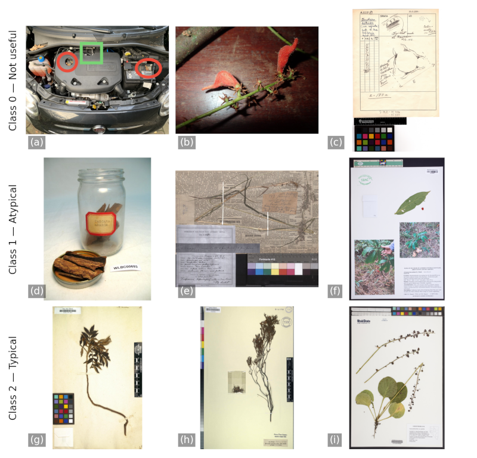

# Malon: Automated Filtering of Atypical Herbarium Specimen Images for Computer Vision Applications

Malon is a lightweight three-class image classifier for triaging herbarium specimen images by their utility for computer vision (CV) applications. It is designed as a first-pass filter for data pollution in large-scale aggregator harvests, assigning images to one of three utility classes prior to pipeline ingestion.

**Powell, C. and Sterner, B.** (in prep). Malon: Automated Filtering of Atypical Herbarium Specimen Images for Computer Vision Applications.

---

## Classes

| Class | Label | Description |
|---|---|---|
| 0 | Not useful | Field photos, label-only scans, closed packets, botanical illustrations, heavily degraded material |
| 1 | Atypical | Wood sections, open fragment packets, non-standard preparations with visible plant material |
| 2 | Typical | Standard pressed and mounted specimens suitable for general CV use |

**Decision rule:** Would a CV algorithm be able to extract meaningful botanical features from this image? Class 0: No. Class 1: Yes, but limited or atypical. Class 2: Yes, standard case. When uncertain, prefer the lower class.

---



*Fig. 1. Schematic of Malon's position within a herbarium image pipeline. Retrieved images are classified into not useful (Class 0), atypical (Class 1), or standard (Class 2) and routed accordingly.*

---

## Repository Contents

```
Malon/
├── model_infer.pt              # Trained SwinV2-T model weights (Git LFS)
├── examples/
│   ├── predict_single.py       # Single image inference example
│   └── predict_batch.py        # Batch inference with class-based sorting
├── data/
│   ├── training_manifest.csv   # Labeled training dataset (gbifIDs, splits, metadata)
│   ├── gbif_predictions.csv    # GBIF hit-rate analysis predictions (n=8,000)
│   ├── results_summary_table.csv  # Hit-rate summary by taxonomic group
│   └── *.csv                   # Publication tables (confusion matrices, benchmarks, splits)
├── notebooks/
│   └── train_3class_CV.ipynb   # Training notebook (local paths, provided for transparency)
└── docs/
    ├── labeling_protocol.md    # Image labeling guidelines used to construct training data
    └── figures/                # Publication figures (pipeline diagram, representative examples, results)
```

---



*Fig. 2. Representative examples of each utility class from the Malon training dataset, all retrieved under `basisOfRecord = PreservedSpecimen`. Class 0 (a–c): car engine compartment, unpressed field collection, botanical illustration. Class 1 (d–f): bark fragments, newsprint-mounted specimen, in situ photographs mounted alongside pressed material. Class 2 (g–i): traditionally pressed vascular plant specimens with clear morphological features.*

---

## Installation

Python 3.11 is recommended. Python 3.12 is also supported. Python 3.13+ may encounter multiprocessing limitations with DataLoader workers.

```bash
git clone https://github.com/CapPow/Malon.git
cd Malon
python3.11 -m venv venv
source venv/bin/activate        # Windows: venv\Scripts\activate
pip install --upgrade pip
pip install torch torchvision --index-url https://download.pytorch.org/whl/cu124
pip install pillow pandas
# Or install from requirements file:
pip install -r requirements.txt
```

**GPU vs CPU:** A CUDA-capable GPU is strongly recommended for practical throughput (~28ms/image batched on RTX 3080). CPU inference is functional but substantially slower (~738ms/image). The examples will automatically use CUDA if available, falling back to CPU otherwise. The CUDA 12.4 wheel above is appropriate for most modern NVIDIA drivers; see the [PyTorch installation guide](https://pytorch.org/get-started/locally/) for other configurations including CPU-only installs.

---

## Quick Start

All examples should be run from the repository root:

```bash
# Single image inference
python examples/predict_single.py

# Batch inference with class-based sorting
python examples/predict_batch.py
```

Both scripts download example images from `data/gbif_predictions.csv` — a set of 8,000 GBIF images verified to be out-of-training-distribution. Image URLs are institution-hosted; **403 errors are normal** and reflect access restrictions on some institutional image servers. The scripts retry automatically from a different record on failure.

> **Note on large images:** Note on large images: Herbarium scans are often very high resolution. PIL will suppress a DecompressionBombWarning for images exceeding its default pixel limit. This is expected behavior and is handled explicitly in the example scripts. Inference time scales with input resolution; pre-scaling images to a consistent width (e.g., 960px) before running Malon substantially improves throughput on raw institutional downloads. The benchmark timings reported in the manuscript reflect pre-scaled images; users running Malon directly on full-resolution institutional downloads should expect slower per-image times than those reported.


Both scripts are intended as starting points. Variables are defined near the top of each file and the example blocks are clearly commented for modification. See inline comments for guidance on adapting to a local image directory.

---

## Data

### `data/training_manifest.csv`
Combined training dataset manifest. Contains `sourceID`, `source` (gbif or inat), `class_id`, `class_name`, `split` (train/val/test), `institutionCode`, `collectionCode`, and `scientificName`. Training images span 153 institutions plus iNaturalist observations. Images are not released due to mixed licensing; gbifIDs and iNat IDs are provided for re-download.

### `data/gbif_predictions.csv`
Per-image Malon predictions for 8,000 GBIF images sampled across four taxonomic groups (Magnoliopsida, Liliopsida, Polypodiopsida, Bryophyta; n=2,000 each). Includes gbifID, image URL, taxonomic metadata, and full class probabilities. These images are independent of the training dataset.

### `data/results_summary_table.csv`
Hit-rate summary table: non-standard image rates per taxonomic group as reported in the manuscript.

---

## Notes on Reproducibility

The training notebook (`notebooks/train_3class_CV.ipynb`) contains local file paths and is not portable as-is. It is provided for transparency and to document training decisions. The released model weights (`model_infer.pt`) are the artifact used for all results reported in the manuscript.

To reproduce the hit-rate analysis, the data/gbif_predictions.csv manifest provides gbifIDs and image URLs for all 8,000 evaluated images. The inference pattern demonstrated in examples/predict_batch.py can be adapted straightforwardly to operate on re-downloaded images. Image URLs in the manifest are institution-hosted and may be subject to access restrictions; querying the GBIF API directly by gbifID is an alternative retrieval strategy that may improve download success rates.

---

## Citation

Powell, C. and Sterner, B. (in prep). Malon: Automated Filtering of Atypical Herbarium Specimen Images for Computer Vision Applications.

---

## License

MIT License. See `LICENSE` for details.
